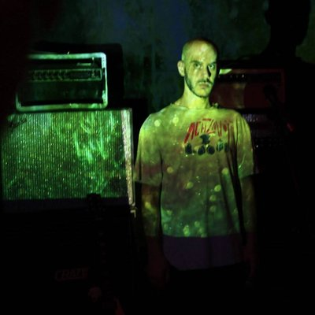

 
Shaul Pollak

    Postdoc, Chisholm Lab 
    MIT

  Bacterial Structure-Function relations: 
                       From genes to ecosystems

 Ecology, Evolution, Genomics, Genetics 
    Experiments, Computation, Theory
    

      <a class="px-1 hover:text-primary-700 dark:hover:text-primary-400" target="_blank" rel="me noopener noreferrer" aria-label="email" href="mailto:spp_micro@protonmail.com"></a>
      <a class="px-1 hover:text-primary-700 dark:hover:text-primary-400" target="_blank" rel="me noopener noreferrer" aria-label="orcid" href="https://orcid.org/0000-0002-8976-5944"></a>
      <a class="px-1 hover:text-primary-700 dark:hover:text-primary-400" target="_blank" rel="me noopener noreferrer" aria-label="scholar" href="https://scholar.google.com/citations?user=MKUzeToAAAAJ&hl=en&oi=ao"></a>
      <a class="px-1 hover:text-primary-700 dark:hover:text-primary-400" target="_blank" rel="me noopener noreferrer" aria-label="github" href="https://github.com/shaul-pollak"></a>
      <a class="px-1 hover:text-primary-700 dark:hover:text-primary-400" target="_blank" rel="me noopener noreferrer" aria-label="twitter" href="https://twitter.com/ShaulPollak"></a>
    
 

