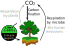
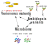

We study how the function and genetic variation of microbial communities emerge from the complexity of interactions they contain.

Microbial communities (also called microbiomes) drive biogeochemical cycling, and are critical for human health and agriculture. A deeper understanding of microbiomes and their interaction with the environment is critical for both basic science and many applications such as sustainable agriculture, composting, and climate modeling.

Our primary source of information about natural microbiomes is DNA sequence data. This is because microbes are tiny and we can't see them with the naked eye, but sampling them is (relatively) easy and sequencing their DNA is cheap and fast. Unfortunately, most of environmental genetic material is uncharacterized, and predicting ecologically meaningful phenotypes (traits) from genomes is hard even for well-characterized microbes. Therefore, the deluge of environmental genomic data produced by the advent of cheap sequencing is still underutilized. We develop combined experimental and machine-learning approaches to go beyond this genomic knowledge gap to allow robust and accurate mapping from microbiome genomic information to community trait configurations. Borrowing ideas from ecological, evolutionary and genetic theory (basically epistasis), we also develop the theory to translate these trait configurations to quantitative community function such as CO2 production rate.

As environmental bacterial geneticists, we are also extremely interested in how host-bacteria genetic interactions evolve in complex ecological settings.

Understanding the causes and consequences of genetic (co-)variation is a fundamental question in biology, and we pursue it happily in the lab and in the field. Our model system is the amazing tri-partite Variovorax-Arabidopsis-Microbiome interaction. Variovorax is a genetically tractable (i.e., we can do targeted genetic manipulations in its genome), highly prevalent soil bacterial genus that interacts strongly with plants and the surrounding microbiome. We study the consequence of genetic variation in Variovorax strains on plant growth as it interacts with different plant genotypes and microbiomes.
