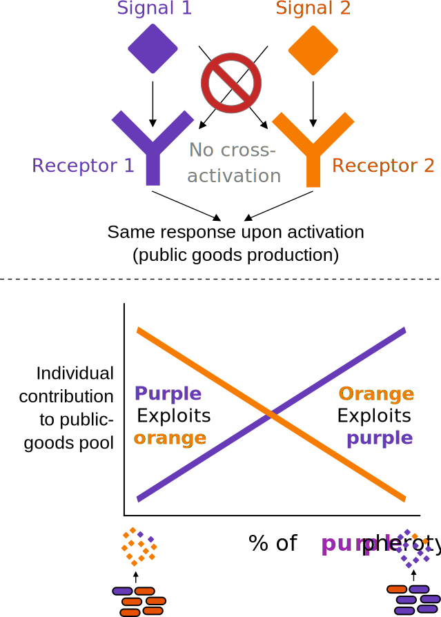

I develop & combine novel experimental, computational, and theoretical approaches to study microbial communities in the lab and in nature

Microbial communities are critical for human health and agriculture, and control all
biogeochemical cycles on earth. **A deeper understanding bacterial communities is critical for
both basic science and many important applications**.

My interest bacterial communities started during my Ph.D, where I was studying cell-cell communication systems called 
Quorum-Sensing systems. It turns out that a single population can contain a staggering diversity at the
quorum sensing locus, resulting in the formation of many "pherotypes" which regulate the same behaviors, but do not
cross-signal. Naive evolutionary theory cannot explain this diversity, and ecological mechanisms that are external
to the system must be invoked to accomodate this diversity. By combining genetics and theory while using the model 
gram-positive bacterium _Bacillus subtilis_, we [showed](https://www.pnas.org/doi/full/10.1073/pnas.1520615113) 
that pherotypes can co-exist because quorum-sensing systems regulate public-goods production, leading to 
facultative cheating and stable co-existence.

My recent work on marine bacterial communities that degrade chitin saw this interest take many forms,
where I collaborated heavily across different projects. Chitin is the most abundant polysaccharide in marine environments, and the second most abundant polysaccharide on earth after cellulose. Chitin recycling by
bacterial communities accounts for a significant portion of marine net primary production and is a central
process in the marine carbon cycle. Bacteria must degrade chitin extracellularly before utilizing it for growth
by secreting specialized enzymes called chitinases. Because the released degradation products are free to
diffuse in the environment, bacteria that are able to consume these molecules but do not degrade the
polymer can be regarded as cheaters.

In my main postdoc [project](https://www.science.org/doi/full/10.1126/sciadv.abi4717) we asked a seemingly simple question – what is the effect
of cheating interactions on community dynamics and chitin turnover? Because most data on bacterial
communities in the environment is DNA sequence data, we wanted to develop computational methods that
could answer this question using genomic information. This is non-trivial because of the gap in our
knowledge about the molecular function of many genes found in environmental DNA samples, and because
we don’t know which cellular processes characterize cheaters. We solved both issues by identifying
thousands of genes that are co-gained/lost together with chitinases from bacterial genomes. Co-evolution is
a strong predictor of shared function and our assumption was that the identified genes contribute to chitin
utilization. The identified genes encoded for diverse functions besides metabolism such as motility and
environmental sensing, but were mostly of unknown function. We developed a machine-learning algorithm
to identify exploiters based on the co-evolving genes, and found that cheating evolved multiple times
throughout evolution, and that exploiters are as common as degraders during early stages of chitin
degradation, potentially impacting carbon turnover on a global scale.
