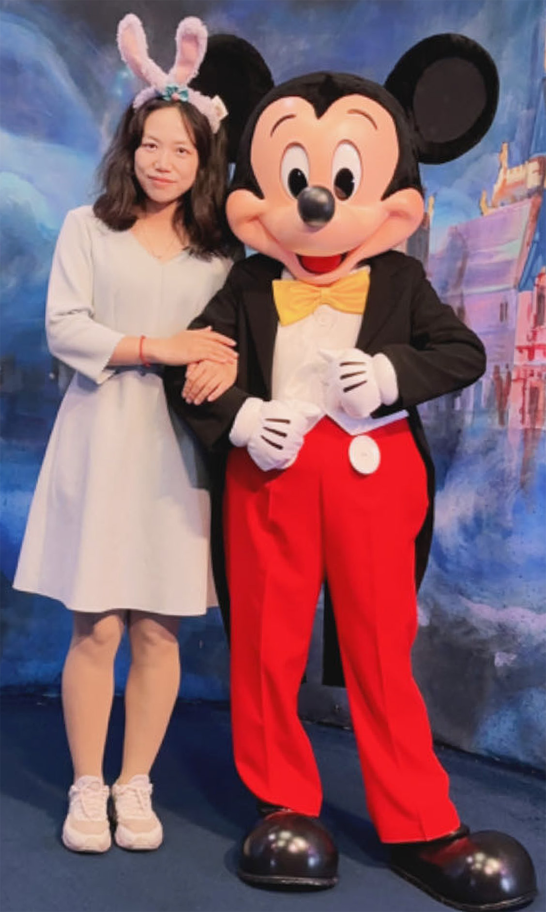
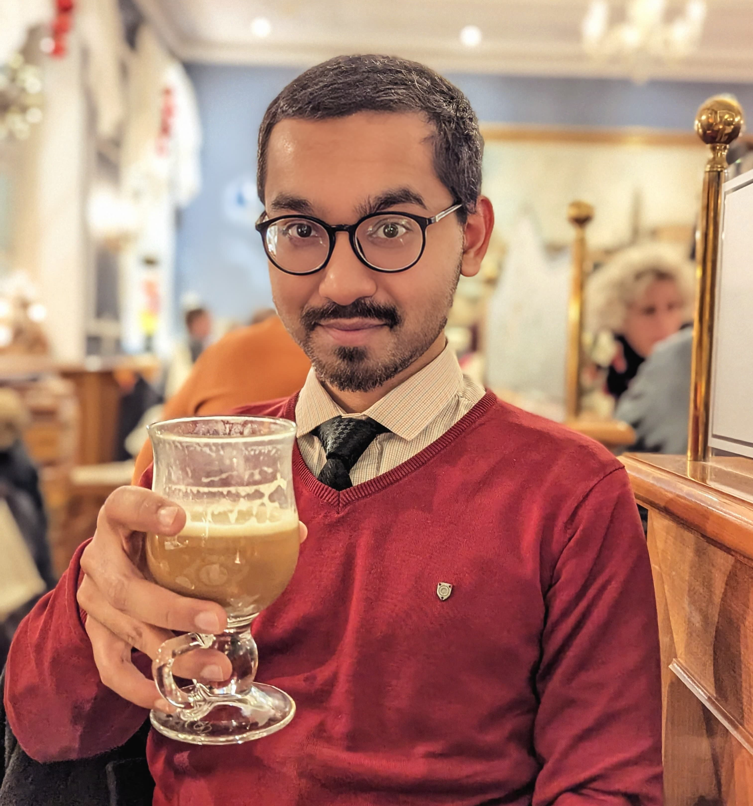

  <figure>
    
    <figcaption>
      <b>Shaul Pollak</b> 
      Principal Investigator 
      <a href="/cv">CV</a>
    </figcaption>
  </figure>

  <figure>
    
    <figcaption class="text-left">
      <b>Qi Qi</b> 
      Postdoc
    </figcaption>
  </figure>

  <figure>
    
    <figcaption class="text-left">
      <b>Lior Shachar</b> 
      PhD Student
    </figcaption>
  </figure>

  <figure>
    
    <figcaption class="text-left">
      <b>Joana Valério</b> 
      PhD Student
    </figcaption>
  </figure>

  <figure>
    
    <figcaption class="text-left">
      <b>Jyothsna P V</b> 
      PhD Student
    </figcaption>
  </figure>

  <figure>
    
    <figcaption class="text-left">
      <b>Rahul Mallikarjun</b> 
      PhD Student
    </figcaption>
  </figure>

  <figure>
    
    <figcaption class="text-left">
      <b>Thomas Gaehtgens</b> 
      PhD Student
    </figcaption>
  </figure>

  <figure>
    
    <figcaption class="text-left">
      <b>Gerhard Gruber</b> 
      Master Student
    </figcaption>
  </figure>

  <figure>
    
    <figcaption class="text-left">
      <b>You!</b> 
      Join us!
    </figcaption>
  </figure>

